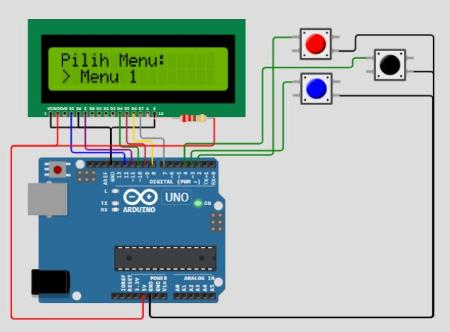
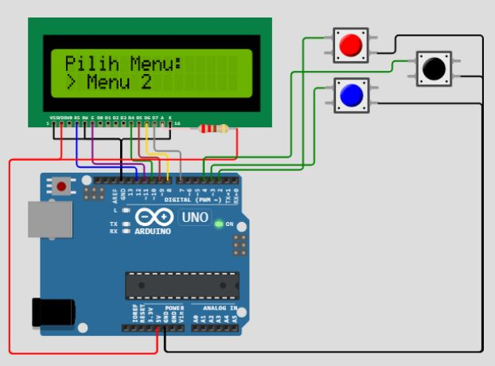

# Proyek LCD 16x2 dengan Arduino Uno R3

Proyek ini adalah contoh penggunaan LCD 16x2 dengan Arduino Uno R3 untuk membuat menu sederhana dengan seleksi kursor. Dalam proyek ini, kita menggunakan library LiquidCrystal untuk mengontrol LCD.

## Alat yang Diperlukan
- Arduino Uno R3
- LCD 16x2
- Jumper wires
- Tombol (misalnya, push button)
- Resistor 10k ohm (1 buah)
- Breadboard atau PCB (untuk menghubungkan komponen)

## Library yang Digunakan
- LiquidCrystal Library
## Codenya
https://github.com/fajarjulyana/menu-lcd1602_arduino-uno-r3/blob/7c6d0195687da587e8458c2281427be30aca777b/src/code.cpp#L4-L132
## Koneksi
 
Berikut adalah koneksi pin antara Arduino Uno R3 dan LCD 16x2:

LCD 16x2    | Arduino Uno R3
------------|---------------
VSS         | GND
VDD         | 5V
VO          | Tengangan potensio (untuk mengatur kontras LCD)
RS          | Pin digital 12
RW          | Pin digital 11
E           | Pin digital 10
D4          | Pin digital 9
D5          | Pin digital 8
D6          | Pin digital 7
D7          | Pin digital 6
A           | 5V melalui resistor 10k ohm
K           | GND

Berikut adalah koneksi pin antara Arduino Uno R3 dan Push Button:

Push Button    | Arduino Uno R3
------------|---------------
Tombol Up   | Pin digital 2
Tombol Down | Pin digital 3
Tombol Enter| Pin digital 4

## Cara Menggunakan
1. Sambungkan LCD 16x2 ke Arduino Uno R3 sesuai dengan skema koneksi di atas.
2. Hubungkan tombol-tombol ke pin digital yang ditentukan dalam kode.
3. Unduh dan pasang library LiquidCrystal jika belum ada.
4. Salin kode program ke Arduino IDE.
5. Sesuaikan kode program jika diperlukan.
6. Unggah kode program ke Arduino Uno R3.
7. Amati tampilan LCD untuk melihat menu dan melakukan seleksi menggunakan tombol.
8. Ikuti petunjuk di dalam kode program untuk menambahkan logika dan fungsi sesuai kebutuhan Anda.

Selamat mencoba!
# Documentations
 
 
 
 
 
ketika menu 1 ditekan enter maka muncul seperti dibawah ini: 
 
